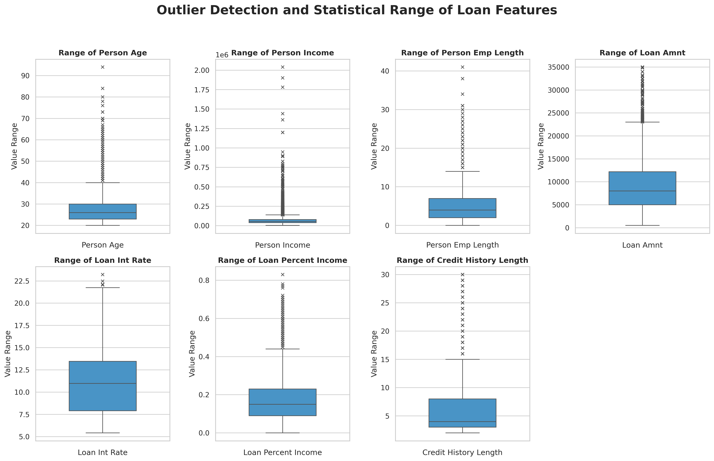
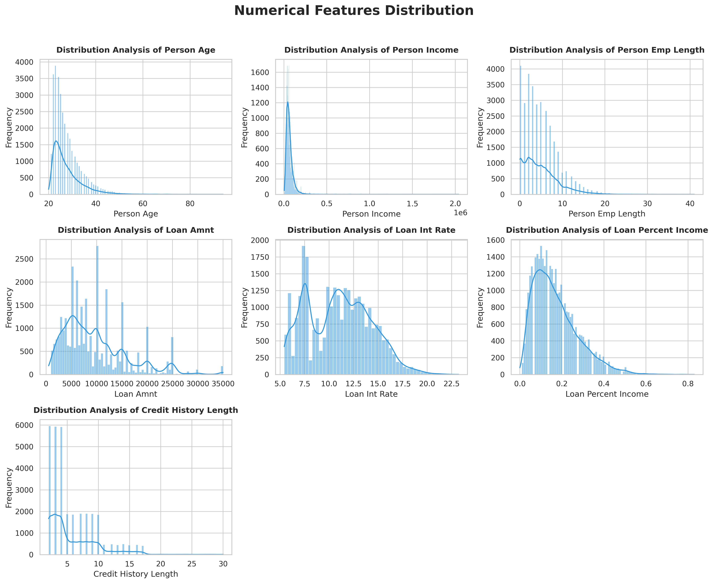
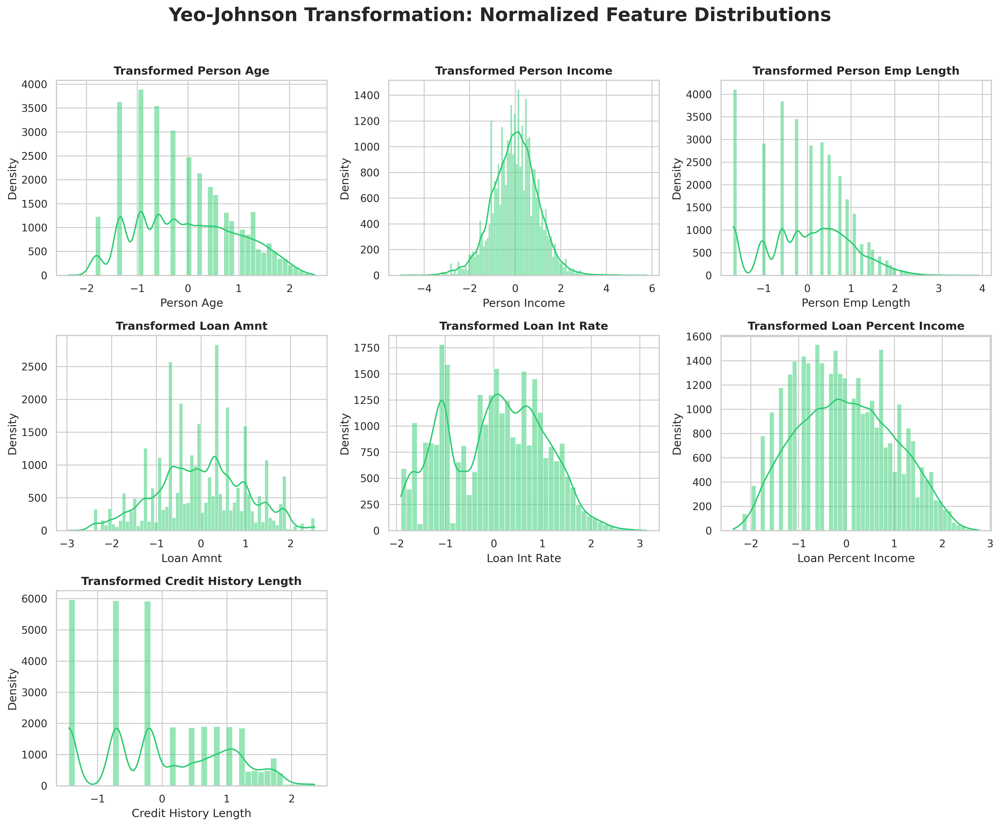
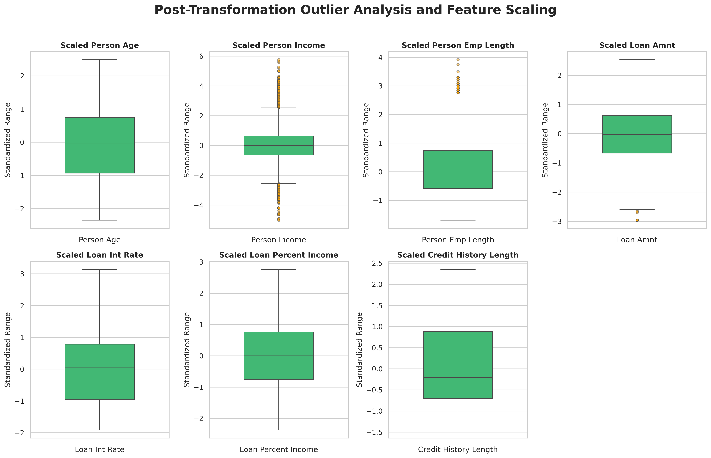
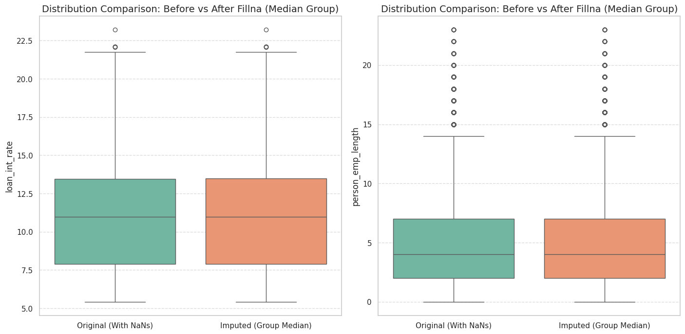
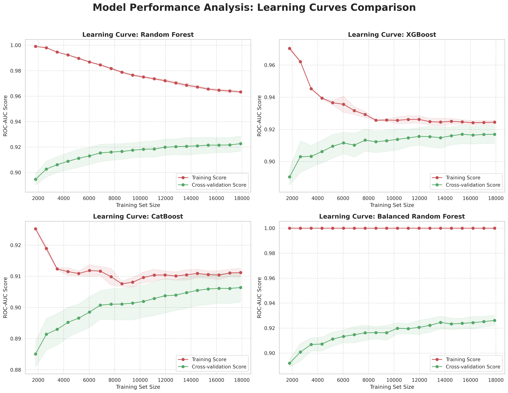
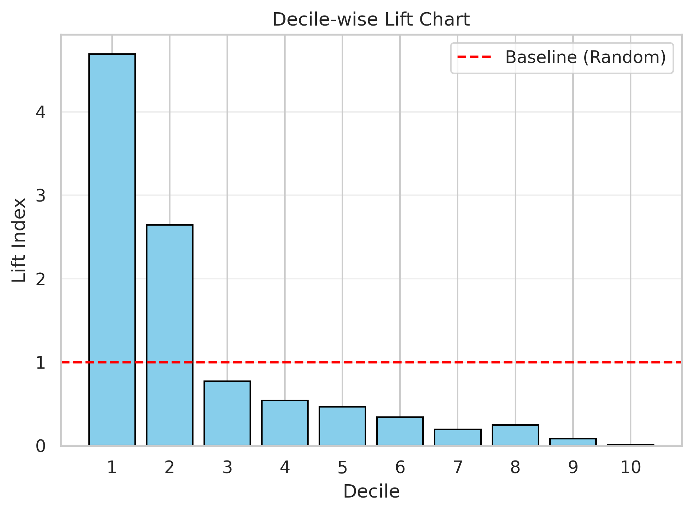
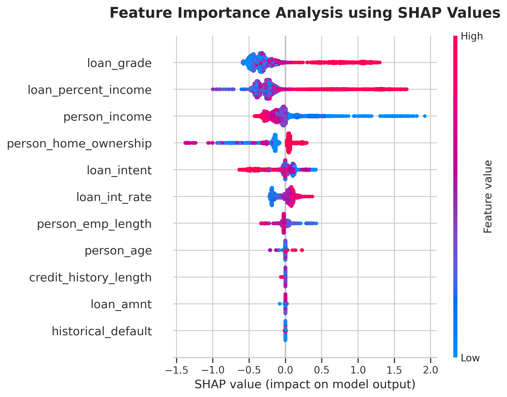

## Overview

Credit risk assessment is one of the most critical tasks in the financial industry. Lenders need to determine whether a loan applicant is likely to repay their debt or default. The challenge is not just building a model that predicts accurately but also can explain *why* a specific applicant was rejected or approved.

This project builds an end-to-end credit risk scoring system using XGBoost as the primary model and SHAP (SHapley Additive exPlanations) as the interpretability layer. The goal is to move beyond a black-box prediction and produce a system that outputs both a risk score and a list of human-readable rejection reasons for each applicant.

---

## Problem Statement

Credit default prediction is a binary classification problem where the target variable `loan_status` takes the value 1 for default and 0 for non-default. The dataset contains 32,581 loan records with 11 input features covering applicant demographics, employment profile, loan characteristics, and credit history. 

One of the main challenges in this dataset is class imbalance which the number of non default cases significantly outnumbers default cases, which means a naive model that always predicts non-default would still achieve high accuracy while being completely useless for risk detection. Standard machine learning models for credit scoring often produce predictions without any explanation, they give no indication of which specific factors drove that score for a given applicant. In credit lending, this is a practical problem. A lender cannot simply tell an applicant their application was rejected because the model returned 0.74. There needs to be a documented, feature-level reason. This project combines XGBoost as the scoring engine with SHAP as the explanation layer to produce both a risk score and a ranked list of the top contributing factors behind each individual prediction.

---

## Dataset

The dataset used in this project is a publicly available credit risk dataset containing 
loan application records. <strong style="background-color:#c9b99a; padding: 2px 6px; border-radius: 4px;">Source: [Kaggle — Credit Risk Dataset](https://www.kaggle.com/datasets/laotse/credit-risk-dataset)</strong>. Each record includes the following features:

- **person_age** — Age of the applicant

- **person_income** — Annual income

- **person_home_ownership** — Home ownership status (RENT, OWN, MORTGAGE, OTHER)

- **person_emp_length** — Length of employment in years

- **loan_intent** — Purpose of the loan (EDUCATION, MEDICAL, PERSONAL, VENTURE, etc.)

- **loan_grade** — Loan grade assigned by the lender (A through G)

- **loan_amnt** — Loan amount requested

- **loan_int_rate** — Interest rate on the loan

- **loan_percent_income** — Ratio of loan amount to annual income

- **historical_default** — Whether the applicant has a prior default on file

- **credit_history_length** — Length of credit history in years

- **loan_status** — Target variable: 1 = Default, 0 = Non-Default

---

## Data Preprocessing

### **Removing Unrealistic Records**

Records with `person_age` greater than 100 and `person_emp_length` greater than 100 were identified and removed. These values are statistically implausible and likely represent data entry errors. Keeping them would introduce noise and distort feature distributions during training.

### **Outlier Detection and Handling**

Outliers were detected using the Interquartile Range (IQR) method across all numeric columns. Box plots were generated to visually inspect the spread of each feature before and after treatment.

### **Feature Transformation**

Numeric features showed right-skewed distributions, which can reduce the effectiveness of certain models. 

The **Yeo-Johnson Power Transformation** was applied to normalize the distribution of each numeric feature. For key features such as `person_income`, `person_emp_length`, and `loan_amnt`, outliers identified after transformation were removed to prevent them from negatively affecting model training.

Before and after distribution plots confirmed that the transformation brought the features closer to a normal distribution without distorting the original data relationships.

### **Missing Value Imputation**

Two columns contained missing values:

- **person_emp_length** — Imputed using the median value grouped by `person_age` and `loan_grade`. This group-level strategy ensures that the imputed values are contextually appropriate rather than using a global median that may not reflect the applicant's profile.
- **loan_int_rate** — Imputed using the median grouped by `loan_grade`, since interest rate is strongly tied to the grade assigned to the loan.

Distribution comparison plots confirmed that the imputation process did not shift the original distribution of either column, preserving the statistical integrity of the dataset.

### **Encoding and Scaling**

Categorical columns (`person_home_ownership`, `loan_intent`, `loan_grade`, `historical_default`) were encoded using Label Encoding. The dataset was then split into training (70%) and test (30%) sets using stratified sampling to maintain the class distribution. Features were scaled using **RobustScaler**, which is resistant to outliers compared to StandardScaler.

---

## Class Imbalance

The target variable `loan_status` is imbalanced, with non-default cases significantly outnumbering default cases. To address this:

- Models with built-in class weighting (`class_weight`, `scale_pos_weight`) were configured to penalize misclassification of the minority class (default) more heavily.
- **Balanced Random Forest** was included as an additional baseline that handles imbalance through undersampling during tree construction.

---

## Model Training and Evaluation

Nine classification models were trained and evaluated:

- Logistic Regression
- Support Vector Machine (SVM)
- K-Nearest Neighbors (KNN)
- Naive Bayes
- Random Forest
- LightGBM
- XGBoost
- CatBoost
- Balanced Random Forest
-
Each model was evaluated using **AUROC (Area Under the ROC Curve)** and **Classification Report**, which provides precision, recall, and F1-score per class.

A custom threshold of **0.6** was applied when converting probabilities to binary predictions, rather than using the default 0.5, to reduce false negatives (missed defaults).

Learning curves were plotted for the top four tree-based models (Random Forest, XGBoost, CatBoost, Balanced Random Forest) to inspect training stability, convergence behavior, and the presence of overfitting or underfitting patterns across increasing training set sizes.

**XGBoost** was selected as the final model based on its overall performance across AUROC, Gini coefficient, and its balance between precision and recall on the minority class.

---

## Credit Scoring with Decile Analysis

After selecting XGBoost as the final model, a decile scoring table was constructed on the test set:
1. Each applicant in the test set was assigned a default probability score using `predict_proba`.
2. Applicants were sorted by descending score and divided into 10 equal-sized groups (deciles).
3. The number of actual defaults and non-defaults in each decile was counted and visualized.

The lift chart reinforces this finding. Decile 1 achieved a lift index of approximately 4.6, meaning the model identified defaults in that group at 4.6 times the rate of a random selection. Decile 2 maintained a lift index above 2.5, still well above the baseline. From decile 3 onward, the lift index drops below 1.0, indicating that the remaining applicants carry below-average default risk. This steep decline from the top deciles is the expected behavior of a well-calibrated credit scoring model, where the highest-risk cases are concentrated at the top of the ranking.

---

## Explainability with SHAP

### Why SHAP?

SHAP is a game-theory-based framework that assigns each feature a contribution value for a specific prediction. SHAP provides **instance-level explanations** that tells us exactly which features pushed a particular applicant's risk score up or down.

### Implementation

A `TreeExplainer` was used, which is optimized for tree-based models like XGBoost and computes SHAP values efficiently. A global summary plot was generated to show which features had the most impact across the entire test set and in which direction.

The most influential features identified were:
- **loan_grade** — This emerged as the most dominant feature. Higher numerical values (representing lower grades like D, E, F, and G) significantly push the model toward a "Default" prediction.
- **loan_percent_income** — A higher ratio of loan amount relative to annual income is a strong predictor of risk, showing a consistent positive correlation with default probability.
- **person_income** — Lower income levels increased the predicted risk.
- **person_home_ownership** — These categorical features also play a substantial role, where certain categories (like "Rent" or "Medical/Debt Consolidation" intents) act as risk accelerators.
- **loan_int_rate** — Higher interest rates were associated with higher default risk.

### Individual-Level Explanations

For each individual applicant predicted as high-risk (probability > 0.6), a **SHAP force plot** was generated to visualize which features were pushing the score above the baseline and which were pulling it down.

Based on these SHAP values, a structured rejection reason generator was implemented. The top features with positive SHAP values (those contributing most to a default prediction) were mapped to plain-language rejection messages, for example:

- *"Loan amount is too high compared to your income."*
- *"Your credit grade does not meet our minimum requirements."*
- *"Records of past payment issues were detected."*

This approach makes the model's output actionable and compliant with the kind of explanation requirements common in lending decisions.

---

## Tools and Libraries

- **Python** — pandas, NumPy, scikit-learn
- **Modeling** — Logistic Regression, Support Vector Machine (SVM), K-Nearest Neighbors (KNN), 
  Gaussian Naive Bayes, Random Forest, Balanced Random Forest, XGBoost, LightGBM, CatBoost
- **Visualization** — Matplotlib, Seaborn
- **Explainability** — SHAP
- **Preprocessing** — PowerTransformer (Yeo-Johnson), RobustScaler, LabelEncoder
- **Export** — joblib
- **Environment** — Google Colab

---

## Source Code

<strong style="background-color:#c9b99a; padding: 2px 6px; border-radius: 4px;">
  <a href="https://github.com/FatiBuuloloo/Interpretable_Credit_Risk_Modeling_Using_Explainable_AI-XAI-_SHAP-mini_project_006">View on GitHub</a>
</strong>
