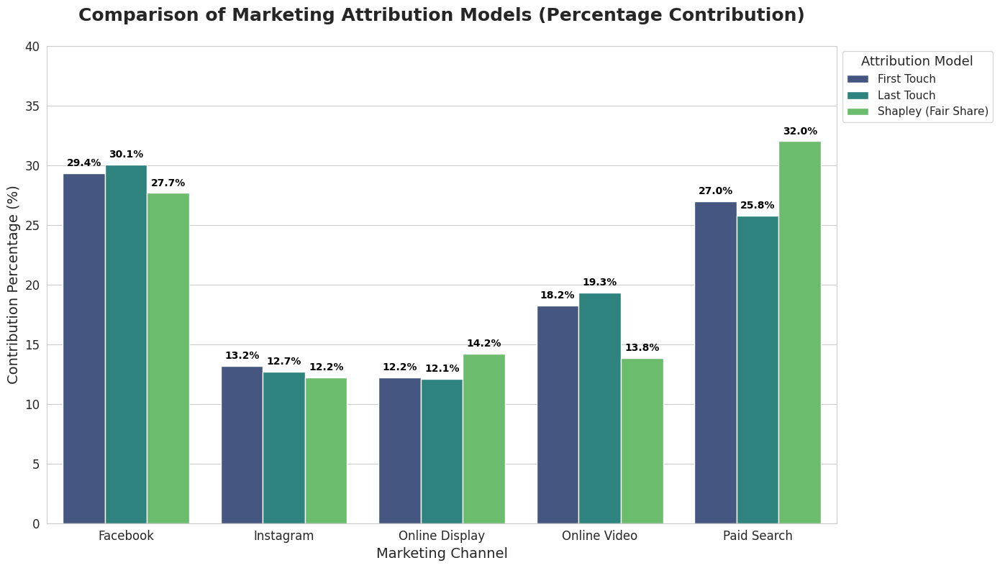

## Overview

This project explores multi touch attribution by replacing traditional heuristic models with a mathematical approach based on Game Theory. By calculating the Shapley Value, we assign a fair contribution percentage to each marketing channel based on its true impact on the customer journey.

---

## Problem Statement

Customers rarely buy a product after seeing just one advertisement. A typical journey involves multiple interactions across different platforms like Facebook, Instagram, and Paid Search. Standard models like First Touch or Last Touch assign all the credit to a single channel. This creates a skewed view of performance and leads to inefficient budget allocation. The goal of this project is to build an attribution model that evaluates the marginal contribution of every channel in the customer journey.

---

## Dataset

The dataset contains customer interaction logs representing various marketing touchpoints.
<strong style="background-color:#c9b99a; padding: 2px 6px; border-radius: 4px;">Source: [Dataset](https://github.com/AjNavneet/MultiTouch-Attribution-Marketing-Spend-Optimization/)</strong>

Key features include:
* **cookie** : Unique identifier for each user
* **time** : Timestamp of the interaction
* **interaction** : Type of event (impression or conversion)
* **conversion** : Binary indicator of purchase
* **conversion_value** : The monetary value of the conversion
* **channel** : The marketing platform (Facebook, Instagram, Online Display, Online Video, Paid Search)

---

## Data Processing

The raw data was transformed to reconstruct individual customer journeys.

* **Journey Mapping**: Sorted interactions by time and grouped them by user to create chronological paths.
* **Touchpoint Extraction**: Identified the initial channel and the final channel for every user path to serve as baselines.
* **Coalition Aggregation**: Grouped paths into unique channel combinations to calculate the total conversions generated by each specific set of channels.

---

## Attribution Modeling

Three distinct models were implemented to compare how credit is distributed across marketing channels.

### First Touch Attribution
Assigns all conversion credit to the very first channel the user interacted with. 

### Last Touch Attribution
Assigns all conversion credit to the final channel the user clicked before making a purchase.

### Shapley Value Attribution
Uses Game Theory to solve the credit distribution problem. Each marketing channel is treated as a player in a cooperative game. The algorithm calculates the marginal contribution of a channel by comparing the conversions of a channel set with and without that specific channel. This is repeated for all possible combinations to find the fair average contribution.

---

## Key Insights and Visuals

The final output is a direct comparison of the three models translated into percentage contributions.

The results reveal significant differences in how channels are valued:
* **Paid Search**: Received the highest credit under the Shapley model (32.03 percent), which was significantly higher than what First Touch (26.97 percent) or Last Touch (25.78 percent) suggested. This indicates Paid Search is a strong supporting channel that closes deals when combined with others.
* **Facebook**: Appeared dominant in First Touch and Last Touch models (around 30 percent) but its true contribution dropped to 27.69 percent under the Shapley model.

---

## Tools and Libraries

* **Language** : Python
* **Data Manipulation** : pandas, itertools, collections, math
* **Visualization** : Matplotlib, Seaborn
* **Environment** : Google Colab

---

## Source Code

<strong style="background-color:#c9b99a; padding: 2px 6px; border-radius: 4px;">
  <a href="https://github.com/FatiBuuloloo/Algorithmic_Marketing_Attribution_using_Shapley_Value_-Game_Theory--mini_project-008">View on GitHub</a>
</strong>
