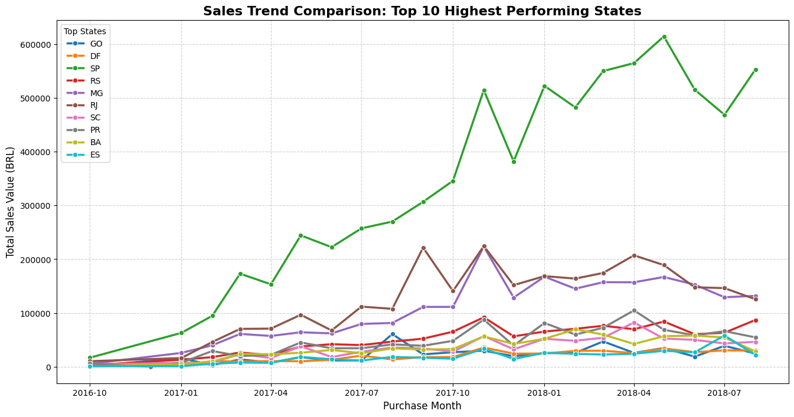
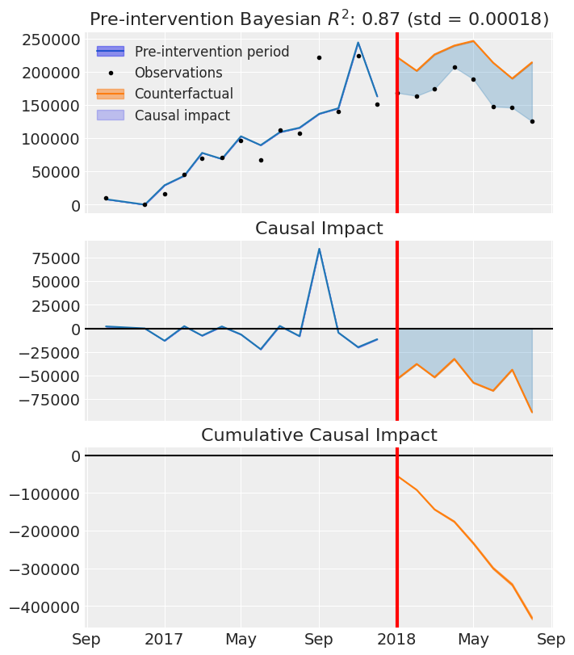
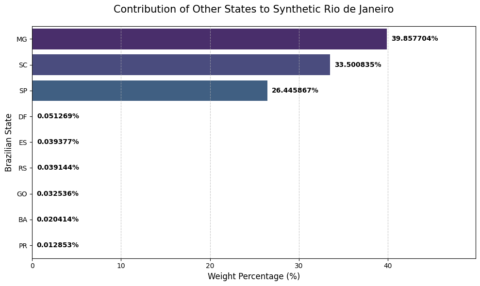
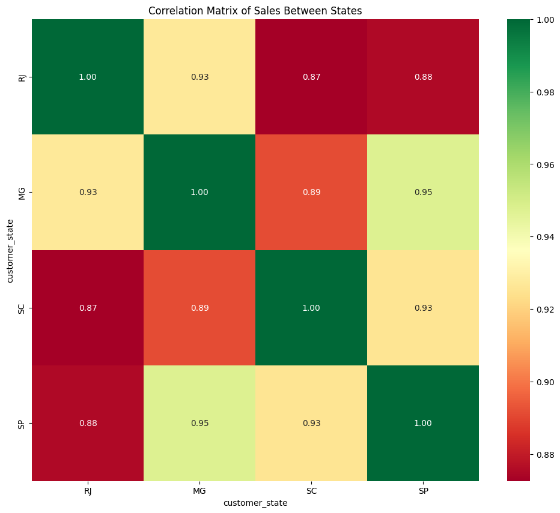
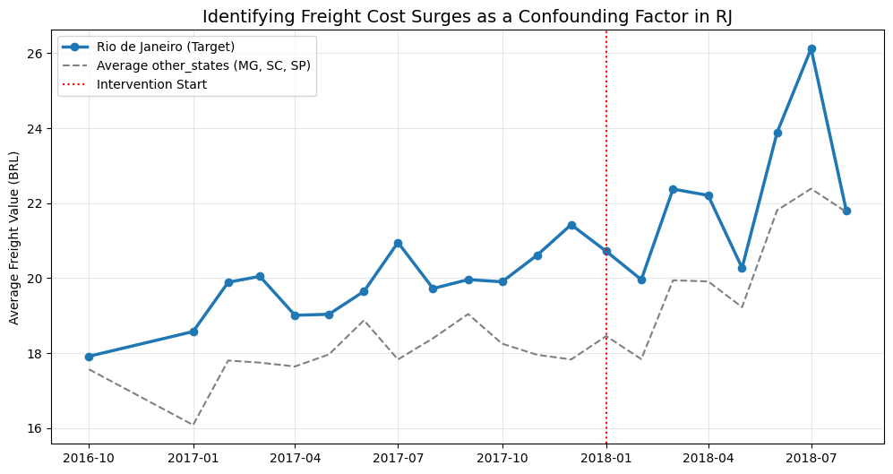
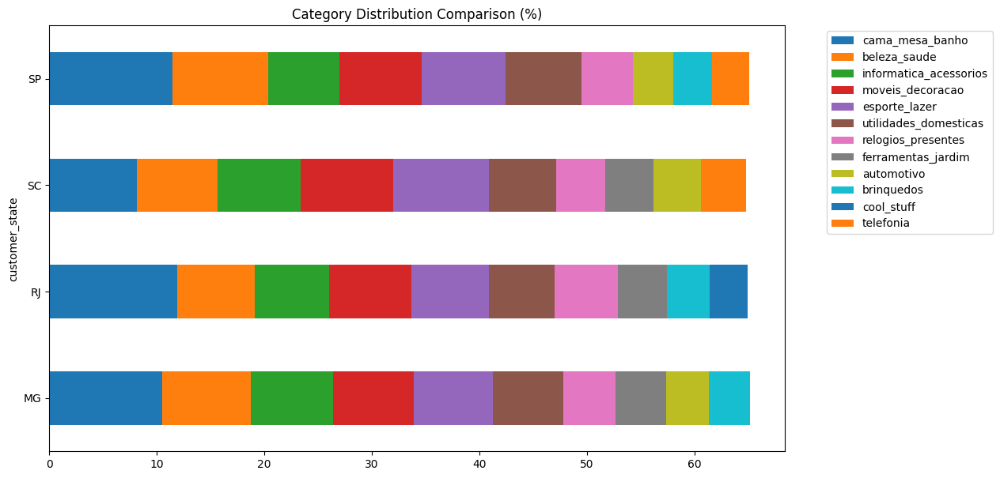
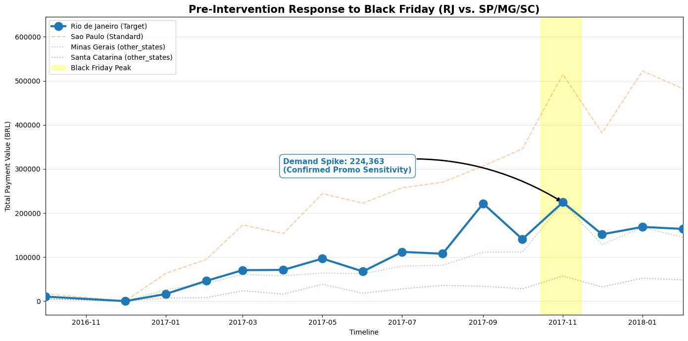

## Overview

This project investigates a marketing intervention launched in January 2018 targeting the Rio de Janeiro (RJ) market. Initial observations indicated a severe decline in sales post-intervention. Using Causal Inference, this analysis quantifies the negative impact. Subsequent Exploratory Data Analysis (EDA) uncovers the true root cause: the failure was not due to poor marketing or lack of consumer interest, but a significant surge in freight (shipping) costs that acted as a major disincentive for buyers.

Dataset: <strong style="background-color:#c9b99a; padding: 2px 6px; border-radius: 4px;">
<a href="[https://www.kaggle.com/datasets/enzoschitini/brazilian-e-commerce-public-dataset-by-olist?resource=download]">View on Kaggle</a>
</strong

---

## Part 1: The Causal Inference Model (What Happened?)

To understand the true impact of the January 2018 intervention, I first analyzed the monthly sales trend across all Brazilian states. I then isolated the top 10 highest-performing states. Rio de Janeiro (RJ) was removed to serve as the target, while the remaining 9 states acted as the "donor pool" to build the Synthetic Control model.

### 1. Bayesian Structural Time Series (Causal Impact)

The three panels below provide a comprehensive view of the intervention's effect:

* **Top Panel (Actual vs. Counterfactual)**: The solid black dots represent RJ's actual sales, while the orange line represents the "Counterfactual" (what RJ's sales would have been without the intervention). The model achieved a high pre-intervention $R^2$ of 0.87, proving its high accuracy. Post-intervention (red line), actual sales plummeted far below the expected trend.

* **Middle Panel (Pointwise Impact)**: This shows the net difference between actual sales and the counterfactual at each specific point in time. The drop is consistently below the zero-line after January 2018.

* **Bottom Panel (Cumulative Impact)**: This illustrates the compounding negative effect over time, showing a massive cumulative loss in sales value by the end of the observation period.

### 2. Synthetic Control Weights: Building "Synthetic RJ"

To create the counterfactual, the model assigned weights to the 9 donor states based on their historical similarity to RJ.

**Insight**: The model heavily relied on Minas Gerais (MG - 39.8%), Santa Catarina (SC - 33.5%), and Sao Paulo (SP - 26.4%). These three states effectively "cloned" RJ's pre-intervention behavior, validating that the control group is structurally robust.

---

## Part 2: Exploratory Data Analysis (Why Did It Happen?)

With the Causal Impact model confirming a significant drop, I shifted to EDA to investigate the why. Was it a marketing failure, a change in product trends, or an external confounder?

### EDA 1: Market Behavior Correlation

Insight: Before diving deeper, I validated the other states (Minas Gerais, Santa Catarina, and Sao Paulo) using a correlation matrix. RJ shows an exceptionally high correlation with MG (0.93), SP (0.88), and SC (0.87). This confirms that historically, these markets move in tandem. If RJ suddenly drops while the others don't, it is a localized issue, not a nationwide macroeconomic trend.

### EDA 2: Logistics Analysis - The Confounding Factor

Pre-2018: The blue line (RJ) and gray dashed line (Control Average) moved in parallel with a consistent gap.

Post-2018 (Intervention): Immediately after January 2018, RJ's freight values spiked drastically, reaching nearly 26 BRL, while the other states stabilized around 22 BRL.

Business Logic: The decline in sales was not caused by a flawed marketing campaign. Customers in RJ likely saw the ads and wanted to buy, but experienced "cart abandonment" upon seeing exorbitant shipping costs at checkout. The freight surge acted as a massive disincentive.

### EDA 3: Product DNA Validation (Eliminating Product Bias)

Insight: Could the drop be because the products sold simply lost popularity in RJ?

Identical Twins: Looking at the bar charts, the product category distribution (DNA) between RJ and MG is almost identical (e.g., cama_mesa_banho, beleza_saude).

Since MG's sales remained stable while RJ's dropped, we can confidently eliminate "product trend changes" as a confounding variable. The problem is definitively how the products get there (logistics), not what the products are. This also explains why our model achieved a high $R^2=0.87$.

### EDA 4: Pre-Intervention Promotional Sensitivity (Black Friday Effect)

Insight: Finally, we investigated if RJ consumers are simply unresponsive to marketing.

Looking at the yellow highlight (Black Friday 2017), RJ (Blue Line) demonstrated a massive, highly responsive demand spike, perfectly mirroring SP and MG.

Conclusion: RJ consumers are highly sensitive to promotions. The failure of the January 2018 intervention was absolutely not due to consumer apathy, further cementing exorbitant freight costs as the true bottleneck.

---

## Final Conclusion & Business Recommendations

The negative causal impact observed in Rio de Janeiro was a symptom of a logistical failure, not a marketing one.

Recommendations:

* **Logistics Restructuring**: The business must urgently audit its third-party logistics (3PL) partners serving the RJ route to negotiate better rates or find alternative carriers.

* **Subsidized Shipping**: Temporarily allocate a portion of the marketing budget to subsidize freight costs in RJ until baseline shipping rates normalize.

* **Localized Warehousing**: Consider establishing a micro-fulfillment center closer to or within RJ to drastically cut last-mile delivery costs.

---

## Tools and Libraries
* Python — core language
* CausalImpact — Bayesian Structural Time Series modeling
* Pandas / NumPy — data manipulation
* Matplotlib / Seaborn — data visualization
* Environment — Google Colab

---

## Source Code

<strong style="background-color:#c9b99a; padding: 2px 6px; border-radius: 4px;">
<a href="[https://github.com/FatiBuuloloo/Causal-Impact-Analysis-Brazilian_E_Commerce-Sales-mini_project-011/tree/main]">GitHub</a>
</strong>
