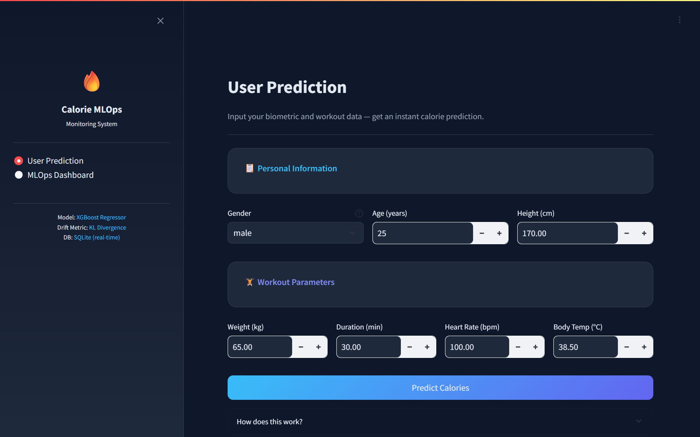
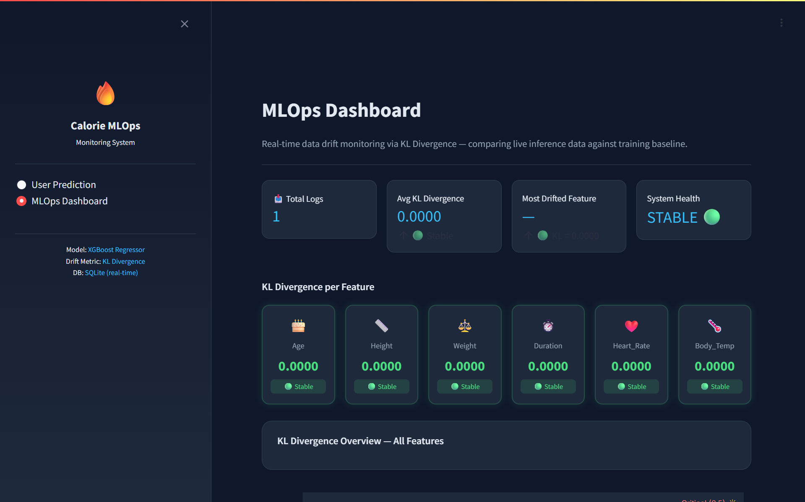

## Overview

Deploying a machine learning model is not the end of a project, its the beginning of a new set of problems. Once a model moves to production, the data that flow in begins to evolve. User demographics shift, device sensors recalibrate, seasonal patterns emerge. If left unmonitored, the gap between the data distribution that the model was trained on and the data distribution it now receives will silently erode its performance. This a phenomenon known as **data drift**.
 
This project builds a complete **MLOps monitoring system** around a trained XGBoost regression model that predicts calorie expenditure from biometric and workout data. The system logs every real-time user input to a SQLite database, transforms that live data to match the training scale, and computes **KL Divergence** between the live and baseline distributions for all features. The results are surfaced through a two-page Streamlit dashboard designed for continuous production monitoring.

---

## Problem Statement

A deployed regression model has no built-in mechanism to detect when the world has changed. Standard deployment workflows where an endpoint is exposed and a prediction is returned provide no signal that the incoming feature distribution has shifted relative to training data.
 
Two problems this project directly addresses:
 
1. **Silent performance degradation**: A model can return syntactically valid predictions even as its underlying accuracy collapses, if its input distribution has drifted far enough from training.
2. **Lack of observability**: Without a monitoring layer, there is no visibility into what data the model is actually receiving in production.
 
The solution is a monitoring pipeline that treats every user inference as a data point and continuously compares the accumulating live distribution against the locked-in training baseline.

---

## Technical Stack

| Layer | Technology | Role |
|---|---|---|
| **Model** | XGBoost Regressor | Calorie prediction |
| **Preprocessing** | PowerTransformer (Box-Cox) + LabelEncoder + StandardScaler| Feature normalization & encoding |
| **Drift Metric** | KL Divergence | Distribution comparison |
| **Database** | SQLite | Real-time inference logging |
| **Frontend** | Streamlit (multi-page) | User interface |
| **Visualization** | Plotly | Interactive charts |
| **Deployment** | HuggingFace Spaces | Cloud hosting |

---

## Model Background
 
The XGBoost model at the center of this system was selected after benchmarking eight regression algorithms on the same dataset. Model selection focused on predictive accuracy, measured by RMSE and MAE on a held-out test set.
 
| Model | RMSE | MAE |
|---|---|---|
| Linear Regression | 0.101 | 0.079 |
| KNN | 0.089 | 0.069 |
| Decision Tree | 0.075 | 0.053 |
| SVR | 0.046 | 0.035 |
| Gradient Boosting | 0.046 | 0.034 |
| Random Forest | 0.043 | 0.030 |
| **XGBoost** | **0.031** | **0.024** |
 
XGBoost delivered the lowest error across both metrics, achieving a test RMSE of **0.031** and MAE of **0.024** on Box-Cox transformed data — outperforming Random Forest by 28% on RMSE. This strong baseline is important for the monitoring layer: the system needs a high-quality model to be worth monitoring.
 
All numeric features (`Age`, `Height`, `Weight`, `Duration`, `Heart_Rate`, `Body_Temp`) were transformed via Box-Cox (`PowerTransformer`) before training; `Gender` was label-encoded using LabelEncoder, and all features were scaled using StandardScaler. Transformers, LabelEncoder and StandardScaler are serialized into `baseline_distribution.pkl` alongside the baseline histograms, ensuring that live data can be transformed identically to training data at inference time.

## System Architecture
 
The application is structured as a Streamlit multi-page app served from a single `app.py` entry point with two pages accessible via the sidebar.
 
```
┌─────────────────────────────────────────────────────────────────────────────┐
│                            STREAMLIT APPLICATION                            │
│                                                                             │
│  ┌─────────────────────────────┐         ┌────────────────────────────────┐  │
│  │       USER PREDICTION       │         │        MLOPS DASHBOARD         │  │
│  ├─────────────────────────────┤         ├────────────────────────────────┤  │
│  │ Input → Label Encoding      │         │ SQLite → Fetch Logs            │  │
│  │ Box-Cox → StandardScaler    │         │ Compute KL Divergence          │  │
│  │ XGBoost → Predict           │         │ Feature Drift Analysis         │  │
│  │ Log Result to SQLite        │         │ Visual Distribution Alerts     │  │
│  └──────────────┬──────────────┘         └────────────────┬───────────────┘  │
│                 │                                         │                   │
└─────────────────┼─────────────────────────────────────────┼───────────────────┘
                  │                                         │
                  │        ┌────────────────────────┐       │
                  └────────►    SQLITE (user_logs)  ◄───────┘
                           │ id • timestamp • raw   │
                           │ features • calories    │
                           └───────────┬────────────┘
                                       │
            ┌──────────────────────────┴──────────────────────────┐
            │               ARTIFACTS & PRESETS                   │
            ├─────────────────────────────────────────────────────┤
            │ • xgb_model.pkl (XGBoost Regressor)                 │
            │ • baseline_distribution.pkl (PT, Scaler, LE, Bins)  │
            └─────────────────────────────────────────────────────┘
```

### Artifact Storage and Presets (`baseline_distribution.pkl` and 'xgb_model.pkl')
 
The baseline pickle file serves as the single source of truth for the monitoring system. It stores:
 
- `transformers.powertransformer` — the `PowerTransformer` object transformed numeric features
- `transformers.labelencoder` — the `LabelEncoder` object for Gender
- `transformers.scaler` — the `StandardScaler` object for scaling all features
- `distributions[feature].prob` — normalized histogram probabilities (baseline P)
- `distributions[feature].bins` — histogram bin edges for each numeric feature
 
This design ensures that the KL comparison always uses the same bins and the same scale, regardless of when or how many times the dashboard is opened.
 
---

## MLOps Pipeline: Detailed Flow
 
### Inference Logging (Page 1)
 
Every time a user submits a prediction:
 
1. `Gender` is encoded with the stored `LabelEncoder`.
2. The six numeric features are transformed with `PowerTransformer` (Box-Cox).
3. All feature were scaled with `StandardScaler`.
4. The XGBoost model predicts calorie expenditure.
5. The transformed (Box-Cox scaled) input and the predicted calorie value are written to user_logs in SQLite for drift monitoring.
 
Storing features in their transformed (Box-Cox) state is a deliberate design choice to streamline the monitoring pipeline. This ensures that the logged data is immediately compatible with the training baseline, allowing the dashboard to compute drift metrics like KL Divergence with maximum precision and minimal computational overhead.

```python
gender_enc = le.transform([gender])[0]
num_values = [float(age), float(height), float(weight), float(duration), float(heart_rate), float(body_temp)]
dummy_val = 1.0 
full_cols = num_cols + ["Calories"]
input_prep = pd.DataFrame([num_values + [dummy_val]], columns=full_cols)
num_transformed = pt.transform(input_prep)[:, :6]
age_pt, h_pt, w_pt, dur_pt, hr_pt, bt_pt = num_transformed[0]
feature_names = ["Gender"] + num_cols
X_combined = np.hstack([[gender_enc], num_transformed[0]]).reshape(1, -1)
X_df = pd.DataFrame(X_combined, columns=feature_names)
X_scaled = scaler.transform(X_df)
val_transformed = float(model.predict(X_scaled)[0])
dummy_features = np.ones((1, 6)) 
padded_output = np.hstack((dummy_features, [[val_transformed]]))
padded_df = pd.DataFrame(padded_output, columns=full_cols)
inversed_result = pt.inverse_transform(padded_df)
val_inversed = float(inversed_result[0, 6])
log_to_db(gender_enc, age_pt, h_pt, w_pt, dur_pt, hr_pt, bt_pt, val_transformed)
```

### Drift Computation (Page 2)
 
When the dashboard loads:
 
1. All rows from user_logs are fetched from SQLite.
2. The dashboard maps the database columns (which are already in Box-Cox transformed scale) to the original feature names for consistency with the baseline.
3. For each feature, the live data is binned using the baseline bin edges to produce distribution **Q**.
4. KL Divergence is computed between the baseline **P** and live **Q** for each feature.

```python
def kl_divergence(p, q):
    p = np.array(p, dtype=float)
    q = np.array(q, dtype=float)
    p = np.clip(p, 1e-10, None)
    q = np.clip(q, 1e-10, None)
    p /= p.sum()
    q /= q.sum()
    kl = float(np.sum(p * np.log(p / q)))
    return kl if np.isfinite(kl) else 0.0

def compute_kl_scores(baseline, df_live_transformed):
    scores = {}
    for feat in num_cols:
        dist          = baseline["distributions"][feat]
        bins          = dist["bins"]
        baseline_prob = dist["prob"]
        col_data = df_live_transformed[feat].dropna().values
        if len(col_data) < 5:
            scores[feat] = 0.0
            continue
        counts, _ = np.histogram(col_data, bins=bins, density=True)
        q_prob     = (counts + 1e-10) / np.sum(counts + 1e-10)
        scores[feat] = kl_divergence(baseline_prob, q_prob)
    return scores
```
---

## Dashboard Components
 
### Page 1 — User Prediction
 
The first page doubles as both a user-facing prediction tool and a data ingestion interface for the monitoring pipeline.
 
- **Biometric Input Form** — sliders and number inputs for all six numeric features plus Gender.
- **Quick Stats Row** — live BMI calculation, estimated maximum heart rate, and current HR zone percentage. These auxiliary stats help users sanity-check their inputs before submitting.
- **Prediction Result Card** — displays the predicted calorie output with burn rate (kcal/min) and intensity classification (Low / Moderate / High).
- **SQLite Log Confirmation** — a success toast confirming the data has been written to the monitoring database.



### Page 2 — MLOps Monitoring Dashboard
 
The second page is the operational monitoring interface. It is designed to be interpretable at a glance.
 
**Summary Metric Row** — four top-level KPIs:
- Total number of logged predictions
- Average KL Divergence across all features
- Most drifted feature (highest individual KL score)
- Overall system health status (Stable / Degrading / Alert)
 
**Feature Drift Cards** — six cards, one per numeric feature, each displaying the feature's KL score and a color-coded badge:
 
| Badge Color | Condition | Meaning |
|---|---|---|
| 🟢 Green | KL < 0.1 | Distribution stable |
| 🟡 Yellow | 0.1 ≤ KL < 0.5 | Moderate drift detected |
| 🔴 Red | KL ≥ 0.5 | Critical drift — retraining advised |
 
**KL Bar Chart** — a comparative Plotly bar chart showing all six feature scores simultaneously, with horizontal reference lines at the warning (0.1) and critical (0.5) thresholds.
 
**Distribution Overlay Plots** — a 2×3 grid of histogram overlays. Each subplot shows the baseline distribution (P, in blue) plotted against the live user distribution (Q, in orange) for one feature. These histograms are plotted on the Box-Cox transformed scale and use the identical bin edges from the baseline pickle, making the comparison statistically valid.
 
**Prediction Trend Chart** — a time-series line chart of the last 50 predicted calorie values, providing a temporal view of model output stability.
 
**Live Log Table** — the last 10 rows inserted into `user_logs`, displayed in a formatted dataframe for real-time activity monitoring.



---

## Conclusion
 
This project demonstrates that a meaningful MLOps monitoring layer does not require enterprise tooling or complex infrastructure. A self-contained system built from SQLite, a fitted transformer object, and KL Divergence over pre-computed histograms can provide continuous, interpretable drift signals for a deployed model and served through a visual dashboard that communicates status clearly to both technical and non-technical audiences.
 
The key insight is that drift detection is only as valid as its preprocessing alignment. By storing the transformer alongside the baseline histograms in a single artifact, this system guarantees that every KL comparison is made on the same statistical scale as the original training data.

---

## Tools and Libraries
 
- **Python** — numpy, pandas, pickle, sqlite3
- **Machine Learning** — XGBoost, scikit-learn (PowerTransformer, LabelEncoder, StandardScaler)
- **Monitoring Metric** — KL Divergence (custom implementation with Laplace smoothing)
- **Frontend** — Streamlit (multi-page via sidebar)
- **Visualization** — Plotly (interactive histograms, bar charts, time-series)
- **Deployment** — HuggingFace Spaces
- **Database** — SQLite

---
## Source Code
 
<strong style="background-color:#c9b99a; padding: 2px 6px; border-radius: 4px;">
  <a href="https://github.com/FatiBuuloloo/MLOps_Data_Drift_Monitoring_for_Calorie_Prediction-mini_project-013">View on GitHub</a>
</strong>

<strong style="background-color:#c9b99a; padding: 2px 6px; border-radius: 4px;">
  <a href="https://huggingface.co/spaces/Viewww/MLOps_Calorie_Prediction_Dashboard/tree/main">View on HuggingFace</a>
</strong>

<strong style="background-color:#c9b99a; padding: 2px 6px; border-radius: 4px;">
  <a href="https://viewww-mlops-calorie-prediction-dashboard.hf.space">Live Demo</a>
</strong>
